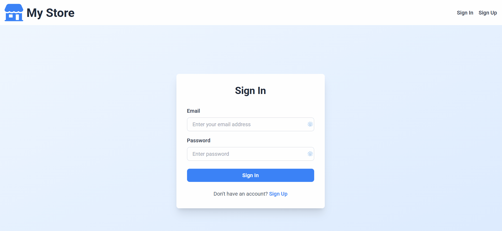

# 🛍️ Firebase E-Commerce App

A modern shopping experience built with React, Firebase Authentication, Firestore, and Tailwind CSS. Users can sign in, browse products, add items to the cart, and proceed to checkout.

## ✨ Features

- 🔐 User authentication with Firebase
- 🛒 Dynamic cart with quantity controls
- 💳 Checkout flow with order summary
- 🧾 Product listing from Firestore
- 🖼️ Product images stored in Firebase Storage
- 🎨 Modern UI with Tailwind CSS

## 🛠️ Tech Stack

- React
- React Router
- Firebase Auth
- Firestore
- Firebase Storage
- Tailwind CSS

## ▶️ Getting Started

1. Clone the repository
   ```bash
   git clone https://github.com/your-username/e-commerce-firebase.git
   cd e-commerce-firebase
   ```

2. Install dependencies
   ```bash
   npm install
   ```

3. Run the app
   ```bash
   npm start
   ```

4. Open http://localhost:3000 to view it in your browser.

## 📦 Build for Production

```bash
npm run build
```

## 📌 Notes

Make sure your Firebase configuration is set up correctly in the Firebase config file before running the app.

## 🎬 Demo GIF

